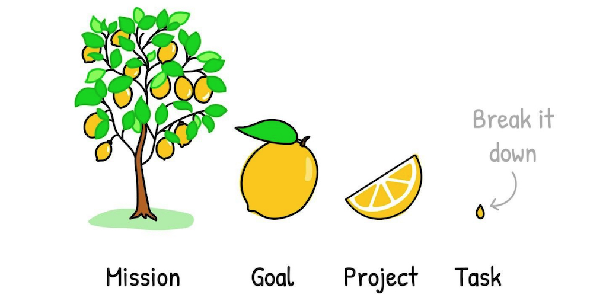

# WidgetX library

## Project Overview

### This project is a WidgetX library built using a custom JavaScript library called X. The library handles the initialization, destruction, and state management of widgets in a DOM tree. It is designed to be environment-agnostic, meaning it can run both in a browser and in Node.js (with the help of JSDOM). The project features four primary operations (Init, Destroy, Done, and Fail), each of which triggers specific behaviors in the widgets.

## Table of Contents

- [Requirements](#requirements)
- [How the Project Was Created](#how-the-project-was-created)
- [Tech Stack](#tech-stack)
- [Installation](#installation)

### Requirements:

1. Environment Agnostic: ✅

   - The library X must work in both browser and Node.js environments. In Node.js, it leverages JSDOM to simulate the DOM structure, ensuring compatibility across platforms.

2. Dynamic Widget Resolver: ✅

   - The library uses a dynamic resolver to load widgets. By default, dynamic imports (import()) are used to load widget modules, allowing flexibility in how widgets are managed and loaded.

3. Asynchronous Initialization and Synchronous Destruction: ✅

   - The X.init() method is asynchronous, meaning it waits for all widgets in the tree to initialize. The X.destroy() method, on the other hand, is synchronous, ensuring immediate cleanup of widgets.

4. Callback Handling in Init: ✅

   - The callback function to the X.init() method. This callback is called once after the entire widget tree has initialized or if there are any errors. Errors during widget initialization prevent child widgets from being initialized, and all encountered errors are passed to the callback.

5. Multiple Init and Destroy Calls: ✅

   - The library supports multiple calls to both X.init() and X.destroy() on any node in the tree, in any order. It guarantees that a widget's init and destroy methods are only called once per instance.

6. Tree Reset After Destroy: ✅

   - After calling X.destroy(), the tree or subtree behaves as though X.init() was never called. If a widget was in the process of being initialized and gets destroyed, a WidgetDestroyedError is thrown, and initialization for that widget is aborted.

7. Widget Initialization: ✅

   - Each widget is responsible for managing its own initialization state. The library provides an API for widgets to mark themselves as initialized in two stages: before subtree initialization and after subtree initialization. This ensures a flexible, widget-driven initialization process.

8. Syntactic Sugar for Event Handlers: ✅

   - Widgets that extend this base class automatically bind event handler methods (methods ending with Handler) to the widget instance, providing syntactic sugar for event handling.

### How the Project Was Created



1. Planning:

   - The project was divided into modules `(X.js, Widget.js, widget files) `to ensure each component had a clear responsibility.
   - The X library manages the widget lifecycle, while each widget class extends the base functionality from `Widget.js.`

2. Widget State Management:

   - The Widget class was built to manage different states of a widget, like when it’s being set up (pre-initialized), fully initialized (initialized), marked as finished (finished), or if it fails (failed). These states are shown visually with CSS classes: p`re-initialized, initialized, finished, and failed`.

3. Environment Handling:

   - The project checks whether it's running in a browser or in Node.js. If it’s in Node.js, it uses JSDOM to imitate a browser environment so the widgets behave the same way.

4. Error Handling:

   - A custom error `(WidgetDestroyedError)` is thrown if a widget is destroyed during initialization. This ensures that any ongoing processes are aware of the interruption.

5. Dynamic Widget Loading:

   - The library uses a dynamic resolver to load widgets as needed. By using JavaScript dynamic imports, it keeps the system flexible and efficient, only loading widgets when they are needed.

6. Event Handling:

   - The base Widget class provides a convenient way to bind event handlers. Any methods that end with `Handler` are automatically bound to the widget instance, simplifying the process of managing widget-specific events.

7. Simplicity and Extensibility:

   - The project focuses on keeping things simple while ensuring flexibility. Developers can easily extend the Widget class to create new widgets, and the X library handles their lifecycle, providing a seamless experience for both developers and users.

### Tech Stack

- JavaScript (ES6+): The core logic for widget library and lifecycle.
- HTML/CSS: The interface for testing and interacting with widgets.
- JSDOM: For testing the project in a Node.js environment.
- Browser (Chrome, Firefox, etc.): For testing in a browser.

### Installation

To set up the project, follow the steps below:

Clone the repository:

```bash
git clone https://github.com/Milan-960/WidgetX-library.git
cd WidgetX-library
```

Install dependencies:

```bash
npm install
```
